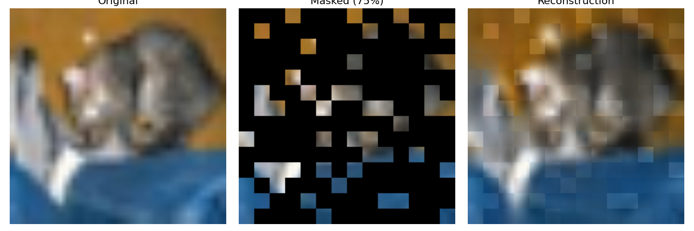
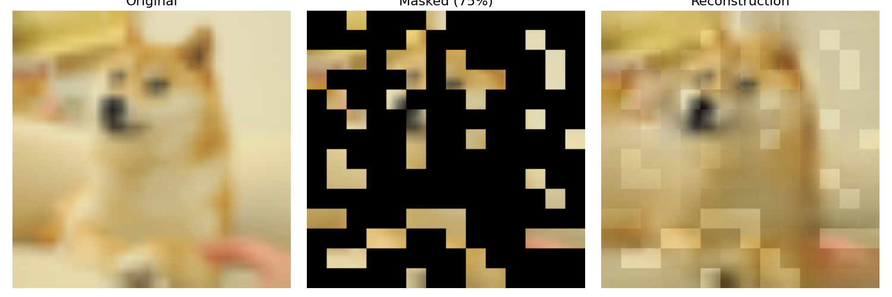
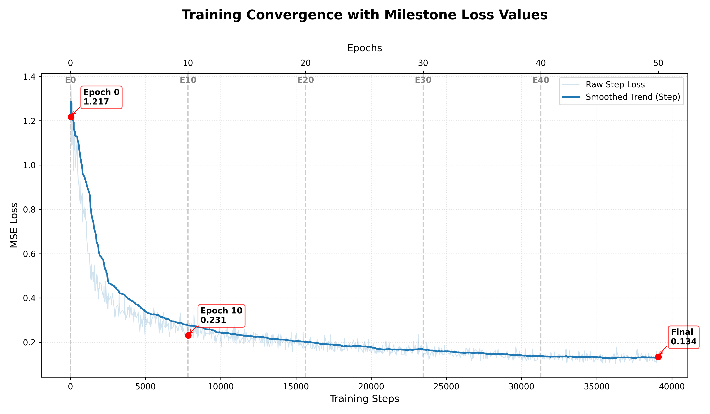
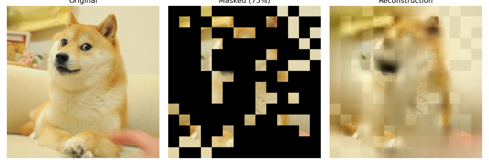

# Masked Autoencoder Vision Transformer Image Reconstruction


[](https://kaggle.com/kernels/welcome?src=https://github.com/Vasco888888/mae-transformer-reconstruction/blob/master/notebooks/training_kaggle.ipynb)

A complete PyTorch implementation of a **Masked Autoencoder (MAE)** using a Vision Transformer (ViT) backbone. This project demonstrates self-supervised learning by heavily masking input images (at a 75% ratio) during training, and generalizing to reconstruct the missing pixels at various inference ratios (e.g., 25%, 50%, and 75%). It evaluates performance on standard CIFAR-10 benchmarks and tests generalization and distribution shift on out-of-distribution (OOD) images.

## Demos

| CIFAR-10 Reconstruction (75% Masked) | OOD Generalization (Doge 75% Masked) |
| :---: | :---: |
|  |  |

## Overview
This project demonstrates an end-to-end pipeline for **Self-Supervised Image Reconstruction**:

1.  **Masking:** Images are divided into non-overlapping patches. A high percentage of these patches (e.g., 75%) are randomly masked out and removed.
2.  **Encoder:** A heavy Vision Transformer (ViT) encoder processes *only* the visible patches to extract dense, high-level latent representations.
3.  **Decoder:** A lightweight ViT decoder receives the latent representations alongside positional "mask tokens" to predict the raw pixel values of the missing patches.
4.  **Application:**
    *   **Baseline Evaluation:** Reconstructing standard 32x32 low-resolution CIFAR-10 images to validate the model's structural learning.
    *   **Inference Generalization:** Testing on complex, real-world images (like the Doge meme) to prove the model learned structural semantics (e.g., animal faces) rather than just memorizing training pixels.
    *   **Distribution Shift Analysis:** Analyzing the model's performance mismatch when fed high-frequency (sharp) unmasked patches against its low-frequency (blurry) training bias.

## Project Report
For a detailed technical analysis regarding MAE architecture choices, loss curves, frequency bias, and visual artifact analysis, please refer to the full report:

**[Project Report (PDF) - COMING SOON]**

## Tech Stack

### **Core Pipeline (AI and Deep Learning)**
*   **PyTorch:** The primary deep learning framework handling model architecture, automatic differentiation, and GPU acceleration.
*   **Vision Transformer (ViT):** The core architecture used for both the encoder (heavy) and decoder (lightweight).
*   **Torchvision:** Handles dataset downloading (CIFAR-10) and comprehensive image transformation/augmentation pipelines (cropping, resizing, normalization).

### **Visualization & Monitoring**
*   **TensorBoard:** Real-time tracking of training loss, learning rate, memory usage, and inline reconstruction previews.
*   **Matplotlib:** Used to generate the final, high-quality side-by-side reconstruction figures.

### **Training Dynamics**
The model was trained using a Cosine Annealing learning rate schedule with linear warmup. The exponential decay of the training loss demonstrates stable optimization and architectural convergence over 50 epochs.



### **Algorithms and Logic**
*   **Patchify & Unpatchify:** Custom tensor operations to seamlessly chop `[B, C, H, W]` images into `[B, N, PatchSize^2 * C]` sequences and back again.
*   **Cosine Annealing with Linear Warmup:** A dynamic learning rate scheduler that rapidly spins up the optimizer before gradually decaying it to ensure stable convergence.
*   **Mixed Precision Training:** Utilizes `torch.cuda.amp` to scale gradients and compute in FP16, heavily reducing VRAM footprint and speeding up training.

---

## How to Run

1.  **Clone the repository**
    ```bash
    git clone https://github.com/Vasco888888/mae-transformer-reconstruction.git
    cd mae-transformer-reconstruction
    ```

2.  **Install dependencies**
    ```bash
    pip install -r requirements.txt
    ```

3.  **Train the Model**
    Run the main script to build the dataset, initialize the model, and begin training. Checkpoints will automatically be saved.
    ```bash
    python train.py
    ```

    *To monitor training:*
    ```bash
    tensorboard --logdir experiments/logs
    ```

4.  **Run Visualizations**
    Generate reconstruction examples on either the CIFAR-10 dataset or an external image.
    *   **Standard Dataset Sample:**
        ```bash
        python visualize.py
        ```
    *   **External Image at Custom Masking Ratio (e.g., 75%):**
        ```bash
        python visualize.py assets/samples/doge.png 75
        ```

---

## Project Structure

```bash
├── assets/                 # Demos, visualizations, and external raw images
├── experiments/
│   └── config.yaml         # Training and model hyperparameters
├── models/
│   ├── mae.py              # Core Masked Autoencoder ViT architecture
│   └── vit.py              # Vision Transformer base implementation
├── notebooks/
│   └── training_kaggle.ipynb # Jupyter notebook for Kaggle training
├── utils/
│   ├── datasets.py         # Torchvision dataset loading and transforms
│   ├── lr_sched.py         # Cosine annealing learning rate logic
│   └── pos_embed.py        # 2D sine-cosine positional embeddings
├── train.py                # Main training loop
├── visualize.py            # Inference and matplotlib rendering script
└── README.md
```

## Challenges and Limitations
*   **Block Artifacts:** The reconstruction exhibits visible block artifacts at the `16x16` patch boundaries. This is an inherent characteristic of the ViT architecture, where non-overlapping patches are processed independently.
*   **Frequency Bias & Distribution Shift:** Because the model was trained exclusively on the low-resolution (32x32) CIFAR-10 dataset, it developed a strong bias for low-frequency (blurry) textures. When tested on high-resolution (sharp) images without prior artificial downsampling, a major distribution shift occurs—the model correctly hallucinates shapes but fails to generate crisp, high-frequency textures, resulting in a painted or patchy look.
    <br>
*   **Training Bottlenecks:** ViT-based architectures are notoriously data-hungry. At only 50 epochs, the model shows generalized structural intelligence but lacks the fine-grained polish seen in models trained for 800+ epochs on ImageNet.

---

## Future Work
*   **Scaling Up Data:** Adapting the data loaders and architecture to train on larger datasets (e.g., ImageNet-1K) to resolve the low-frequency texture bias.
*   **Extended Training:** Running the training loop for the recommended 800-1600 epochs to smooth out patch-boundary artifacts.
*   **Downstream Fine-Tuning:** Testing the pre-trained MAE encoder's latent representations on downstream tasks like linear probing for image classification.
